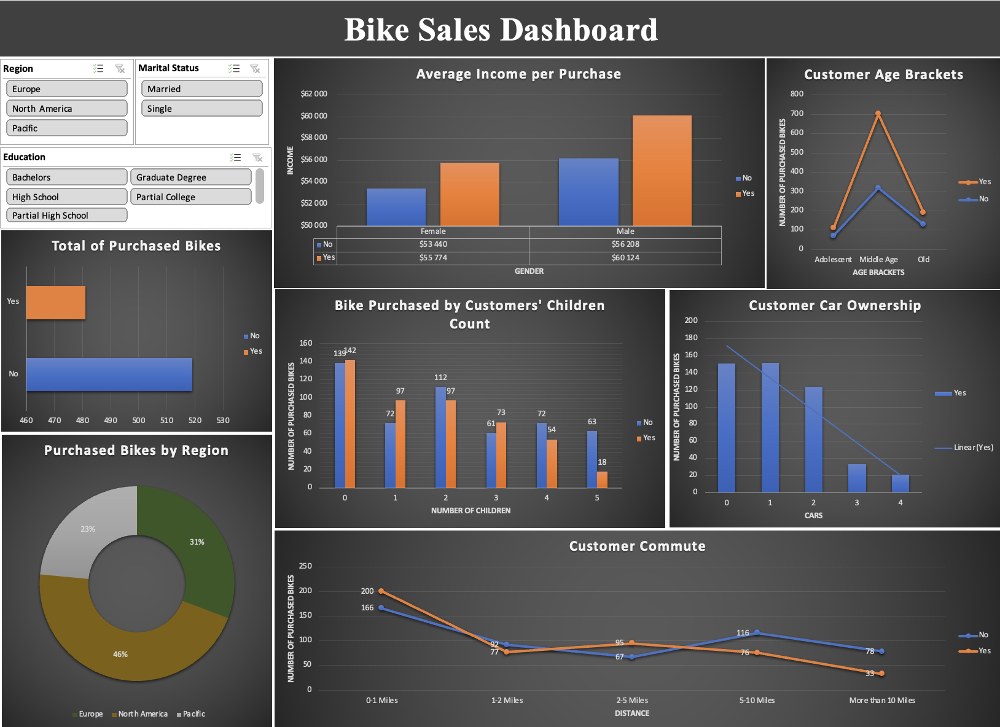

# Excel-Bike-Sales-Analysis

## Overview

This project focuses on analyzing bike sales data to uncover meaningful trends, patterns, and insights that can help businesses make informed decisions. It was designed as a portfolio piece to showcase my data analysis skills using Microsoft Excel, including data cleaning, transformation, and dashboard creation.

## Inspiration and Dataset

I was inspired to create this project after watching a **YouTube video by Alex the Analyst**, where he walked through a similar Excel project. I used the same dataset provided in the video as a starting point and expanded upon it with my own visualizations and insights. This dataset contains customer information, including demographic, financial, and lifestyle data, as well as whether they purchased a bike.

- **Link to Alex the Analyst’s video**: [Excel Portfolio Walkthrough](https://youtu.be/opJgMj1IUrc?si=6REsIWOvdYkaDasW)
- **Link to the dataset**: [Bike Sales Dataset](https://github.com/AlexTheAnalyst/Excel-Tutorial/blob/main/Excel%20Project%20Dataset.xlsx)

While the original video provided guidance, I aimed to make my project unique by designing different visualizations and offering fresh insights into the dataset.

## Objectives

1. **Understand Customer Demographics**:
   - Identify customer segments most likely to purchase bikes.
   - Analyze the impact of factors like age, marital status, income, and education on bike purchases.

2. **Evaluate Sales by Region**:
   - Compare bike sales across different regions to identify high-performing areas.
   - Provide actionable insights into regional marketing strategies.

3. **Explore Key Buying Behaviors**:
   - Examine the role of commute distance, car ownership, and family size in purchasing decisions.
   - Assess correlations between income levels and bike purchases.

## Data Cleaning Process

The dataset was prepared using the following steps:
1. **Removed Duplicate Entries**: Ensured unique customers were included in the analysis.
2. **Reformatted Income**: Standardized income values as numeric for accurate analysis.
3. **Expanded Abbreviations**: Replaced abbreviations in marital status and gender columns with full terms for clarity.
4. **Created Age Brackets**: Grouped ages into categories:
   - Young Adults (<31 years).
   - Middle-aged Adults (31–45 years).
   - Old-aged Adults (>45 years).
5. **Final Checks**: Verified missing values were handled and data was properly categorized.

## The Dashboard

Below is the interactive dashboard created to visualize key insights from the dataset:  
  

## Key Insights

- **Income and Gender**: Higher income individuals are more likely to purchase bikes, with males having a slightly higher purchase rate than females.
- **Age Trends**: Middle-aged adults are the primary bike-buying demographic.
- **Regional Performance**: North America leads in bike purchases, followed by Europe and the Pacific region.
- **Family Size**: Customers with 0–2 children are more likely to buy bikes.
- **Commute Distance**: Customers commuting between 5–10 miles are more inclined to purchase bikes.
- **Car Ownership**: Fewer cars owned correlates with a higher likelihood of bike purchases.

## Problem Solving with the Dashboard

### Problem: Understanding Key Customer Demographics
- **Solution**: The dashboard segments data by age, income, and family size, helping businesses target marketing campaigns effectively.

### Problem: Optimizing Regional Strategies
- **Solution**: Regional analysis enables companies to focus resources on areas with the highest potential for growth.

### Problem: Exploring Lifestyle Factors
- **Solution**: Insights into commute distance and car ownership allow for better positioning of products in eco-friendly and urban markets.

## Recommendations

1. **Focus Marketing on Key Demographics**:
   - Target middle-aged adults (31–45 years), particularly those with higher incomes,       as they are the primary bike-buying demographic.
   - Develop gender-specific marketing campaigns, as males slightly outpace females in       purchases.
2. **Leverage Regional Insights**:
   - Prioritize North America for sales efforts, as it leads in bike purchases.
   - Invest in campaigns to boost performance in underperforming regions like the           Pacific.
3. **Explore Commute and Eco-Friendly Opportunities**:
   - Promote bikes as a cost-effective, eco-friendly commute option to customers            traveling 5–10 miles.
   - Highlight the environmental benefits of biking to appeal to customers with fewer       cars or urban lifestyles.
4. **Enhance Family-Oriented Marketing**:
   - Focus on families with 0–2 children, as they show the highest likelihood of            purchasing bikes.
   - Offer family bundles or discounts to encourage multiple purchases.

---

